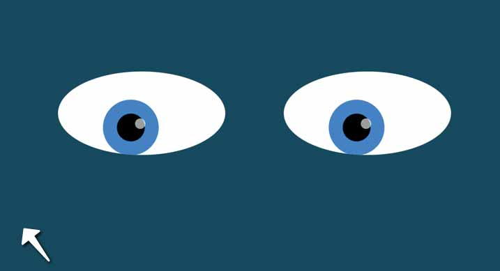

# MIT - Eye Movement Animation

### Title: Eye Movement Animation

This MIT's assignment consists in using DIVs to simulate 2 eyes on an webpage, the eyes eyes follows the user's cursor while it's being moved through the screen.

## Executing program

Download the zip folder with the source code file and open the index.html on the browser of your chouce.

## Author

Thiago Petrimperni
Student at MIT - Full Stack Development with MERN
